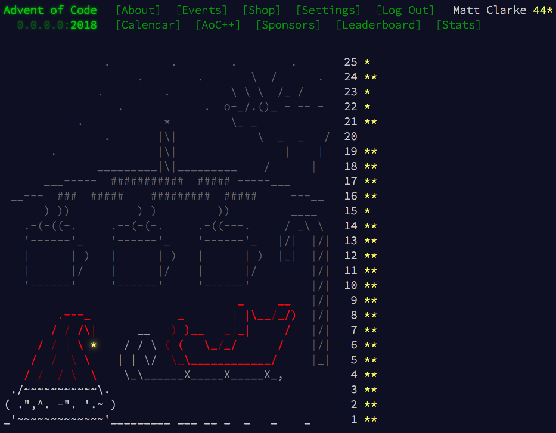

# advent_of_code_18
https://adventofcode.com/2018

## Results (December 2018)

### Day 15 (revisited in 2021)
- Turns out my original algorithm was sound, the mistake for part 2 was to use binary search. It is possible to get no deaths
for, say, elf damage rate 13, but to have deaths for all the numbers lower and higher like 14, 15, 16, etc. This is because the
 positions and movements differ depending on the damage rate. E.g. for a high damage the elf might move towards a group of
 goblins sooner than if elf had a lower damage rate, so would get extra rounds of multiple damage from the group.
- Note, I rewrote the whole thing because I incorrectly thought the original was broken - the new one is much faster at least :)

### Day 20 (revisited in 2021)
- I must have not read this properly originally, as I thought it was more complicated than it was. Basically its just using a
stack where "(" is push on, "|" is peek and ")" is pop.
- Then it is a case of keeping track of which room you are in and the distance to get to it. If you revisit a room then update
the distance if the new distance is lower.
- Just "reducing" the regex gave the correct answer to part 1, but it might be a fluke, and it certainly doesn't help with Part 2

### Day 22 (revisited in 2021)
- First attempt is BFS shortest path, takes a long long time though...
- Small change to use a heap ordered by path length, x and then y rather than a simple queue => ~1 second!

### Day 23 (revisited in 2021)
- Struggled with a few ideas, then discussed with my wife and we came up with a sort of binary search. Failed to implement it
successfully, so looked at the discussion on Reddit. Basically ended up copying this one: https://github.com/fhinkel/AdventOfCode2018/blob/master/day23.js
- This method would fail if, say, one had 10 non-overlapping bots in one grid and 9 overlapping bots in another grid because
it would choose the grid with 10 as the best solution for the next iteration.
- The solution to this would be to not throw away the other grid but put all grids in a queue/heap which is sorted by number of bots
(high to low), then by grid size (high to low) and, finally, by distance from the origin. Then all likely candidates will
eventually make it to the front of the queue.
- I'm not planning to do this ;)

# TODO?
- Day 13 is a bit slow
- Day 18 part 2 is super slow
- Day 19 work out what is going on
